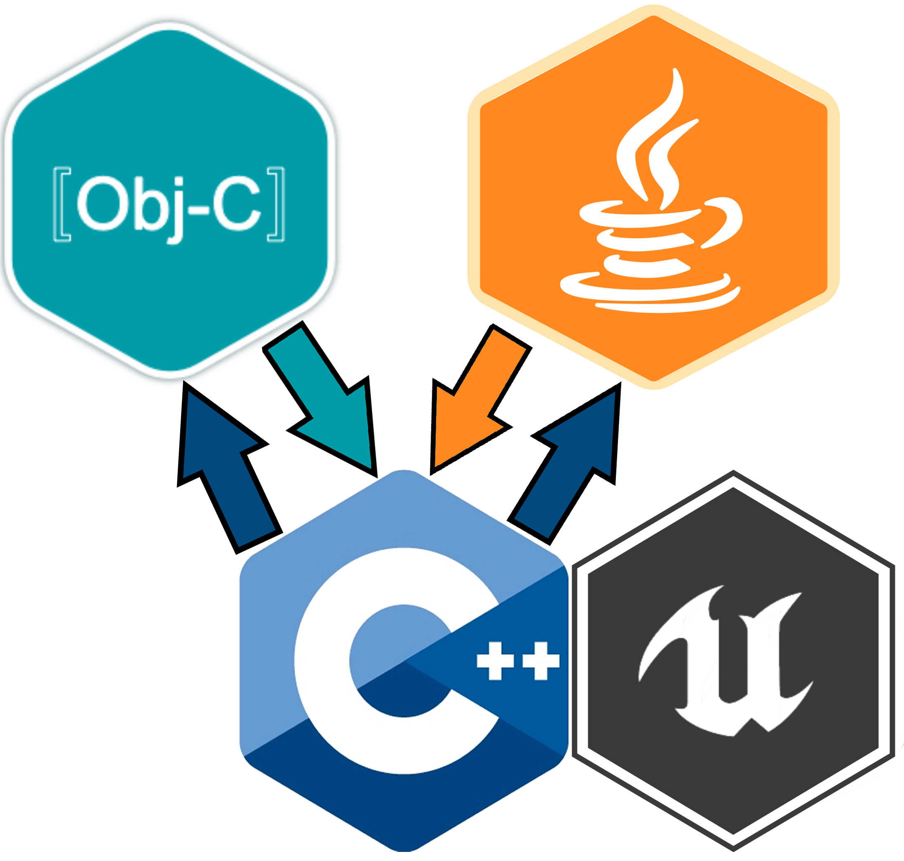

# Mobile Native Code Plugin

**Mobile Native Code Plugin** - служит основой для собственного мобильного плагина в Unreal Engine 4 для платформ Android и IOS. В нём реализован удобный вызов нативного кода Java(JNI) и Objective-c, а также примеры подключения статических и динамических библиотек в систему сборки. Просто переименуйте все названия *PLUGIN_NAME* во всех папках и файлах на собственные и получите нужный вам плагин.

**Нативный код Objective-C для IOS скоро появится**.

* **Требуется Unreal Engine 4.24 или выше.**

## Особенности
* Собирается на ndk-14 и ndk-21 для Android
* Вызов нативного кода Java одной функцией из C++
* Visual Studio нужен для сборки плагина

## Установка
Скопируйте *PLUGIN_NAME* в папку *Plugins*, расположенную в главном пути вашего проекта (Если её нет, то создайте).

Включите *PLUGIN_NAME* в *Edit -> Plugins -> Installed -> PLUGIN_NAME*.

В LevelBlueprint уровня создайте схему.

* Запустите на вашем мобильном устройстве (IOS пока не поддерживается).

## Тестирование в *Unreal Engine 4.24* на **Nexus 5** - *OpenGL ES2* - *armeabi-v7a* - **ndk-r14b**

## Тестирование в *Unreal Engine 4.25* на **Honor Play** - *OpenGL ES3.1* - *arm64-v8a* - **ndk-r21b**

# Дополнительная информация

## Для Android
Для вызова собственного Java класса:

* Добавьте свой Java класс в папку *PLUGIN_NAME\Source\PLUGIN_NAME\Private\Android\Java*
		
* Измените *package* на **package com.epicgames.ue4;**
 
* Класс должен быть публичным (*public class*), как и его функции (*public static void*)

* Перед классом и функциями добавьте *@Keep*

* Перейдите в *\PLUGIN_NAME\Source\PLUGIN_NAME\Private* и откройте *PLUGIN_NAMEBPLibrary.cpp*.
  В данном файле продемонстрированы 3 функции для вызова Java кода.

* Java код вызывается с помощью **AndroidUtils::CallNativeAndroid< ReturnType >("com/epicgames/ue4/YourClass", "YourFunction", false, "arg1","arg2","arg3")**, если функция что-то возвращает.

* *ReturnType* указывается в зависимости от возвращаемого типа. *1 аргумент* это package+название вашего класса, *2 аргумент* название вашей функции, *3 аргумент* указывает - нужно ли передать Activity данного сеанса. Далее кол-во аргументов может быть передано сколько угодно, в зависимости от того, что принимает ваша функция.

* В случае если Java функция ничего не возвращает (Void) то вызывается **AndroidUtils::CallNativeAndroidVoid("com/epicgames/ue4/YourClass", "YourFunction", false, "arg1","arg2","arg3")**

* Асинхронный вызов Java происходит посредствам диспетчеров: код Java вызывает функцию C++, которая в свою очередь активирует его.

* При добавлении нового Java класса или изменении текущего - удаляйте папку *Intermediate* в папке вашего проекта.

## Для iOS
* Нативный код Objective-C для IOS скоро появится...
